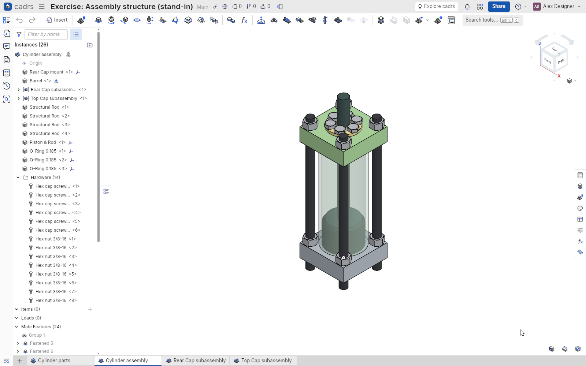
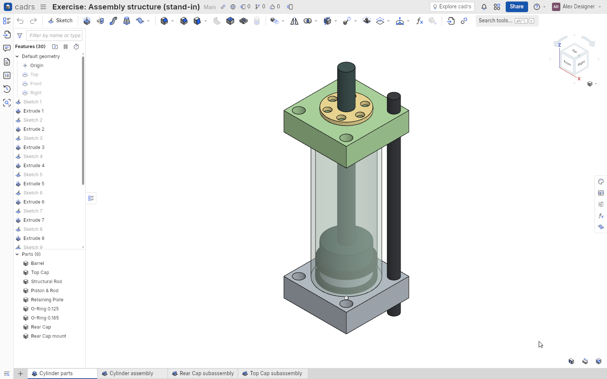
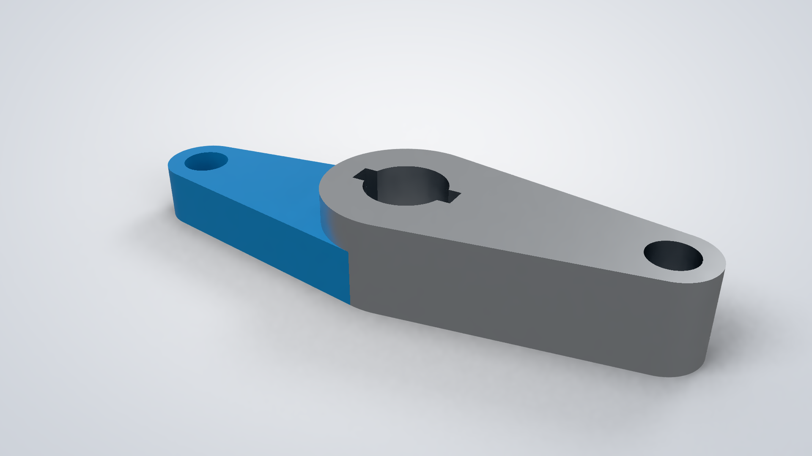

# cadrs

[](https://github.com/rvdende/cadrs/actions/workflows/ci.yml)
[](#license)
[](https://www.rust-lang.org)
[](https://bevyengine.org)

**A parametric, feature-based CAD app written in Rust**, with a Bevy UI and an OpenCASCADE
modeling kernel. Its workflow follows Onshape's: sketch on a plane, constrain and dimension,
build parts from features, put them together in assemblies, and make drawings from them.



> **Status: early and moving fast.** cadrs works through the Onshape Learning Center's CAD
> Basics courses exercise by exercise, but it is not yet a finished tool. Expect rough edges,
> and file formats that may still change.

## Features

- **Sketching**: lines, rectangles, circles, arcs, splines, Bézier curves, ellipses, polygons,
  slots, points and text. Snapping and inference to points, midpoints, centres, intersections,
  alignments and part edges. Geometric constraints and driving dimensions, with a
  least-squares solver that keeps the sketch consistent while you drag. Trim, extend, split,
  offset, mirror, patterns, and Use (project) of part edges.
- **Part Studios**: extrude, revolve, sweep, loft, fillet, chamfer, shell, draft, hole
  (counterbore, countersink, tapped; ISO and ANSI tables), linear and circular patterns,
  mirror, booleans, Transform, planes, mate connectors, thicken, fill and helix. Every feature
  can be edited later, and the part rebuilds.
- **Assemblies**: instances, fastened, revolute, slider, cylindrical, planar and other mates,
  a triad to move parts, mate connectors, exploded views and a bill of materials.
- **Drawings**: standard and projected views, sections, dimensions, annotations, callouts
  and BOM tables.
- **More**: versions and history, derived parts and linked documents, a variable table and
  expressions, measurement and mass properties, linear static simulation (FEA), a path-traced
  renderer, PCB Studio with IDF import and export, and STEP, IGES and STL import and export.
- **Onshape import**: bring your own Onshape documents across with their feature history
  instead of dead STEP geometry ([tools/onshape](tools/onshape/README.md)).

<p>
  
  
</p>

## Building

You need a stable Rust toolchain ([rustup](https://rustup.rs)), CMake and a C++ compiler.
The first build compiles OpenCASCADE from source, which takes several minutes; later builds
are incremental.

On Debian or Ubuntu, Bevy also needs these:

```sh
sudo apt install cmake g++ pkg-config libasound2-dev libudev-dev libwayland-dev libxkbcommon-dev
```

Then:

```sh
git clone https://github.com/rvdende/cadrs
cd cadrs
cargo run --release
```

Documents are stored in your platform's data folder (on Linux, `~/.local/share/cadrs/`).

A Windows build can be cross-compiled from Linux with MinGW:
`cargo build --release --target x86_64-pc-windows-gnu`.

## Using it

The mouse and keys follow Onshape's: right-drag orbits, middle-drag pans, and the wheel zooms
toward the cursor. **Shift+S** starts a sketch, **Shift+E** an extrude, **N** views normal to
the sketch plane, **Shift+7** gives the isometric view, and **F** zooms to fit. **Shift+/**
(or Help › Keyboard shortcuts) lists the rest.

## Development

```sh
cargo test --workspace                    # all tests
cargo clippy --workspace --all-targets    # lints
cargo run -- --headless --scenario <name> # run a scripted scenario, saving screenshots
```

Scenarios (`scenarios/*.ron`) drive the real app with synthetic input and write PNGs to
`target/scenarios/<name>/`. The golden tests in `crates/cadrs/tests/golden.rs` compare them
with baselines kept on your machine (`tests/golden/`, not committed); the first run records
them, and `CADRS_BLESS=1` saves new ones.

### Layout

| Crate | What it is |
|---|---|
| `cadrs` | The binary: command-line flags, windowed or headless |
| `cadrs_app` | The app's Bevy plugins: documents page, tabs, viewport, tools and dialogs |
| `cadrs_ui` | A reusable Bevy widget library (theme, buttons, inputs, menus, dialogs, lists) |
| `cadrs_core` | The document model, features, rebuild, commands and undo, persistence (no Bevy) |
| `cadrs_sketch` | Sketch geometry, constraints, the solver, snapping and hit testing (no Bevy) |
| `cadrs_kernel` | Our solid-modeling API over OpenCASCADE, with persistent face and edge names |
| `cadrs_drawing` | Drawing views, projection and annotations |
| `cadrs_fea` | Linear static finite-element analysis |
| `cadrs_render` | A CPU path tracer for photorealistic renders |
| `cadrs_idf`, `cadrs_pcb` | IDF files and PCB boards |
| `cadrs_onshape` | The Onshape document importer |
| `cadrs_harness` | Scripted scenarios, synthetic input and screenshots |

[crates/cadrs_kernel/README.md](crates/cadrs_kernel/README.md) describes the modeling layer:
the kernel API, persistent face and edge naming, and the OpenCASCADE backend. The notes in
`reference/onshape/` record how Onshape behaves, which is what cadrs is measured against.

## License

Licensed under either of

- Apache License, Version 2.0 ([LICENSE-APACHE](LICENSE-APACHE) or
  <http://www.apache.org/licenses/LICENSE-2.0>)
- MIT license ([LICENSE-MIT](LICENSE-MIT) or <http://opensource.org/licenses/MIT>)

at your option.

Unless you explicitly state otherwise, any contribution intentionally submitted for inclusion
in this work by you, as defined in the Apache-2.0 license, shall be dual licensed as above,
without any additional terms or conditions.

Third-party parts keep their own licenses: the [Inter](https://rsms.me/inter/) font is under
the SIL Open Font License ([assets/fonts/OFL.txt](assets/fonts/OFL.txt)), and
[OpenCASCADE](https://dev.opencascade.org/) under the LGPL 2.1 with the OCCT exception.

## Disclaimer

cadrs is an independent project. It is not affiliated with, endorsed by or sponsored by PTC
or Onshape. Onshape is a trademark of PTC Inc. cadrs uses its own icons, font and branding.
